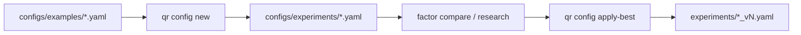

# Plan: `qr config new`（实验脚手架）

状态：`done`  
目标：开局从 `configs/examples/` 复制骨架到 `configs/experiments/`，消掉 Agent 临时 `.py` / 手抄摩擦；与 `apply-best` 对称（开局 vs 迭代）。

对齐闸门（[agent.md](../../agent.md) §1）：配置契约无新字段 → **引擎 + CLI + 用例 + skill/md**。

---

## 1. 背景与分工

| 命令 | 角色 |
|------|------|
| **`qr config new`**（本计划） | 开局：examples → experiments；空 signals；设 `study_id` |
| `qr config apply-best`（已有） | 迭代：run `best_params` → 新 YAML |

引擎不自动切年；`evaluation.train_years` 仍由 agent 按 `sample_profile` 填写（脚手架只给空骨架，不写死年份）。



---

## 2. CLI 契约

```bash
qr config new \
  [--from configs/examples/event_factors.yaml] \
  --out configs/experiments/<topic>_<yyyymmdd>_<tag>.yaml \
  --study-id <id> \
  [--set hypothesis.id=...] \
  [--set evaluation.primary_metric=absolute] \
  --format json --quiet
```

| 参数 | 规则 |
|------|------|
| `--from` | 默认 `configs/examples/event_factors.yaml`；路径必须在 `configs/examples/` 下（resolve 后）；禁止从 `experiments/` 当模板 |
| `--out` | **必须**落在 `configs/experiments/`；已存在 → `ApplyBestError` 同类 config 错误 exit 2；拒写 `examples/` |
| `--study-id` | 必填；写入 `hypothesis.study_id` |
| `--set` | 可重复；dotted `key=value`（YAML 标量：str/int/float/bool/null）；深度 merge；**禁止**通过 `--set` 写入非空 `signals.filters` / `rank_by`（或写后再强制清空） |
| 全局 | `--format` / `--quiet` 已有 |

### 脚手架规范化（写盘前强制）

1. 深拷贝 YAML（保留注释困难则 `yaml.safe_load` + `safe_dump`，与 `apply-best` 一致）。
2. **`signals.filters = []`，`signals.rank_by = []`**；若有 `composite` → `enabled: false` 且清空/保留空 `components`。
3. 确保 `hypothesis.study_id`；若无 `hypothesis.id` 且未 `--set`，可默认等于 `study_id`。
4. 若缺 `evaluation`：注入最小骨架（**无年份**）：

```yaml
evaluation:
  primary_metric: absolute
  train_years: []
  validate_years: []
  holdouts: []
  statement_hint: ""
```

5. 校验：`ResearchConfig.model_validate(data)` 通过后再写盘。
6. `out.parent.mkdir(parents=True)`；UTF-8 无 BOM。

### 信封

- `command`: `config.new`
- `summary`: `{ out, from, study_id, signals_cleared: true, evaluation_injected: bool, sets_applied: [...] }`
- `artifacts.config`: 写出路径
- `next_actions`: 如 `study decision (strategy_design)` / `factor compare with --config <out>`（短列表即可）
- 错误：路径违规 / 模板缺失 / out 已存在 / `--set` 非法 → exit **2** (`CONFIG`)

---

## 3. 实现落点（最小改动）

| 文件 | 改动 |
|------|------|
| `qresearch/engines/experiment/scaffold.py`（新） | `ScaffoldError`；`scaffold_experiment_yaml(...)`；路径闸门可抽与 `apply-best` 共用小 helper（可选：`path_guards.py` 或 scaffold 内复制拒写逻辑，避免大重构） |
| `qresearch/cli.py` | `@config_app.command("new")` |
| `tests/test_config_new.py`（新） | 见 §4 |
| `.cursor/skills/qresearch/strategy-design.md` | 落盘改为 `qr config new`；禁止临时 py / 手抄 |
| `.cursor/skills/qresearch/reference.md` | CLI 表增加一行 |
| `.cursor/skills/qresearch/SKILL.md` | 闭环步骤 2 / 硬性规则旁注：开局用 `config new` |
| `README.md` | CLI map 一行（破坏/新增 CLI 行为） |
| `agent.md` | 可选一句：实验脚手架用 `qr config new` |

**不做（v1）**

- 从 `experiments/` 克隆历史
- 自动填 `train_years`
- 一键 research
- 保留 YAML 注释（与 apply-best 同限）

---

## 4. 单测

`tests/test_config_new.py`（tmp_path 下假 examples/experiments）：

1. 默认 from + study_id → out 存在；`signals.filters/rank_by` 空；`hypothesis.study_id` 正确  
2. 模板若故意带非空 filters → 写出仍为空  
3. 拒写 `configs/examples/...`  
4. `--from` 指向 experiments → 拒绝  
5. out 已存在 → 拒绝  
6. 缺 evaluation 的最小模板 → 注入空 evaluation  
7. `--set hypothesis.id=foo` 生效；`--set` 非法路径/校验失败 → 错误  
8. CLI 烟雾：`CliRunner` 或直接调 scaffold（与 `test_apply_best` 风格一致）

跑：`pytest -q tests/test_config_new.py tests/test_apply_best.py`

---

## 5. Skill / Agent 约定（交付后）

开局标准动作：

```bash
qr config new --out configs/experiments/<name>.yaml --study-id <id> --format json --quiet
# 读信封 summary.out → 再填 evaluation 年份 / 因子后写 signals（可用编辑器或后续 apply-best）
```

反模式：临时 `.py` `yaml.dump`；`Write` 整份手抄 examples；从 experiments 扫抄旧 signals。

---

## 6. 实现顺序与验收

| 步 | 内容 | 验收 |
|----|------|------|
| A | `scaffold.py` + 路径闸门 | 单测 1–7 绿 |
| B | CLI `config new` + 信封 | 单测 8 / 手工 `--format json --quiet` |
| C | skill + README（+ agent 一句） | 无手抄步骤；reference 有命令 |
| D | `pytest -q` 相关 + 全量可选 | 无回归 |

**完成定义**

- Agent 开局可仅靠 CLI 得到合法空信号 experiment YAML  
- 无法写坏 examples  
- 文档与四位一体对齐清单勾完

---

## 7. 风险与备注

- Windows 路径：闸门用 `resolve()` + posix 归一（照抄 `apply_best_to_yaml`）。
- Cursor `Write` 到 gitignored/experiments 仍可能失败；CLI 走 Shell 是正路径，skill 写明优先 `qr config new`。
- `--set` 解析：简单 `key=value`（value 走 `yaml.safe_load`）；不支持嵌套 JSON 对象 v1。
