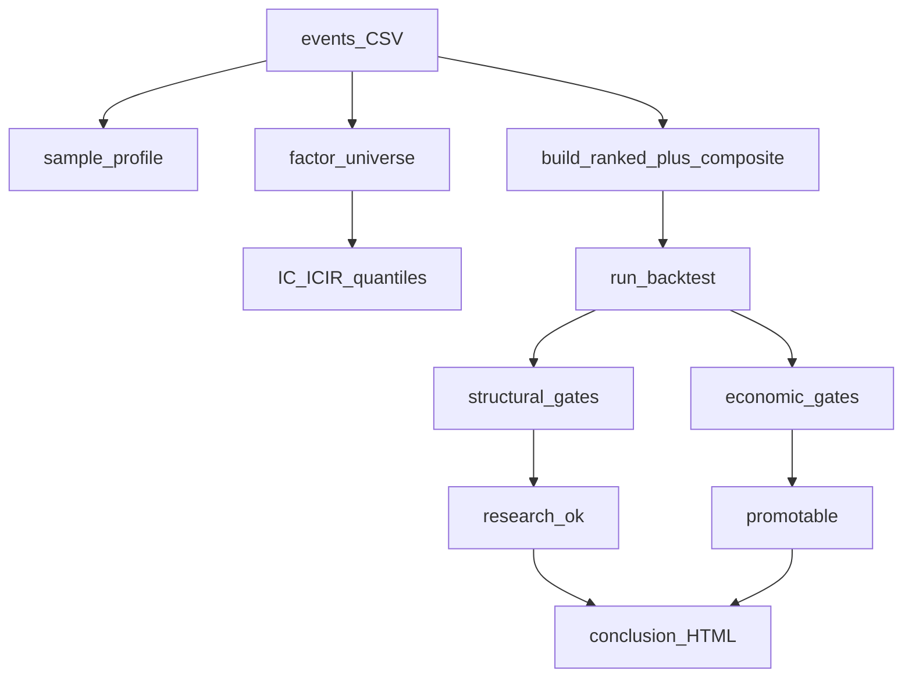

# P0/P1 研究硬化实现计划

定位：在现有日频事件回测 + Agent CLI 架构上，补齐「因子不草率」与「门禁不等于可实盘」，并增加敏感度扫描与简单因子合成。  
约束：不引入 vnpy；行情仍经 zer0share；信封 JSON 兼容扩展字段；行为变更补合成 panel 单测。

## 背景与问题

| 现状 | 问题 |
|------|------|
| `evaluate_gates` 结构/经济绑同一 `promotable` | 亏损 run 仍可显示可晋升 |
| `min_oos_sharpe` / `max_oos_drawdown` 默认 `None` | 经济门禁实际关闭 |
| IC 取 `features.*` 前 12 列 | 含 name 等垃圾列；无分层/ICIR |
| 无假设字段进 meta | 难做投研台账 |
| 无敏感度 CLI / 合成因子 | 执行风控与因子组合靠手工 YAML |



---

## P0-A：样本剖面 + 因子白/黑名单 + 分层收益 + ICIR

### 配置（`qresearch/config/models.py`）

新增 `FactorsConfig`，挂到 `ResearchConfig.factors`：

```yaml
factors:
  include: []              # 空 = 自动候选
  exclude:                 # 默认内置，YAML 可覆盖
    - features.name
    - features.industry
    - features.support_levels
    - features.resistance_levels
  min_non_null: 100
  n_quantiles: 5
  icir_min_periods: 4
  max_features: 32         # research 内 IC 扫描上限
```

### 新/改模块

| 文件 | 职责 |
|------|------|
| `engines/factor/universe.py` | `resolve_feature_cols(events, cfg)`：类型/非空/黑白名单 |
| `engines/factor/sample_profile.py` | 年分布、标的数、特征非空率、重复键 → dict |
| `engines/factor/ic.py` | 保留 `compute_ic_table`；新增 `compute_icir_table`、`compute_quantile_returns` |

ICIR：按 `entry_intent_date` 的自然年切片算 Rank IC，再 `mean/std`（段数 < `icir_min_periods` 则 ICIR=null）。  
分层：事件内按特征分 `n_quantiles` 层，对指定 horizon 算 `_fwd_return` 均值。

### 管线 / CLI

- `pipeline_research`：写 `artifacts/sample_profile.json`、`icir_summary.csv`、`quantile_returns.csv`；IC 改走 universe（不再盲目 `[:12]`）
- `qr factor compare`：同样走 universe；信封增加 top ICIR 摘要与 artifacts 路径

### 测试

- 黑名单列不出现在 resolve 结果
- 单调特征：顶层 quantile 收益最高；ICIR 表有期望列

---

## P0-B：假设字段 + 经济门禁与笔数门禁分离

### 配置

```yaml
hypothesis:
  id: platform_box_prer1
  statement: "短窗 pre_r1 IC 为负，排除突破事件"
  expected_sign:
    features.pre_r1: negative
  parent_run: null

gates:
  min_oos_folds: 2
  min_trades: 10
  max_n_trials: null
  pit_strict: false
  # 经济门禁：给出安全默认，防止「空 = 可实盘」
  min_oos_sharpe: 0.0
  max_oos_drawdown: 0.35
  min_deflated_sharpe: null
  require_economic_for_promote: true
```

说明：`GatesConfig` 已有 `min_oos_sharpe` / `max_oos_drawdown`，本次改为**有默认值**，并拆返回结构。示例 YAML 写清；若某实验只要结构门禁，可显式 `min_oos_sharpe: null` 且 `require_economic_for_promote: false`。

### `evaluate_gates` 新语义

```python
{
  "structural_passed": bool,
  "economic_passed": bool,
  "passed": structural_passed,              # 研究可继续
  "promotable": structural and economic,  # 默认可晋升条件
  "reasons": [...],                         # 全部失败原因
  "structural_reasons": [...],
  "economic_reasons": [...],
}
```

结构：`min_oos_folds`、`min_trades`、`max_n_trials`、`pit_strict`  
经济：`min_oos_sharpe`、`max_oos_drawdown`、`min_deflated_sharpe`

- `promote` 仍只认 `conclusion.promotable`
- `build_conclusion` / 中文报告展示两段门禁 + `hypothesis`
- `meta.json` 写入 `hypothesis` 与分段 gates
- 更新 `tests/test_deflated_sharpe.py`，新增「结构过、经济不过」用例
- **预期行为变化**：上一轮亏损 run 在新默认下 `promotable=false`

---

## P1-A：执行/风控敏感度扫描 CLI

```bash
qr pipeline sensitivity --csv <events> --config <exp.yaml> \
  --cost-mult 1,1.5,2 \
  --stop -0.05,-0.086,-0.12 \
  --take 0.10,0.158,0.20 \
  --max-grid 27 \
  --format json --quiet
```

- 新模块 `engines/experiment/sensitivity.py`：网格（截断 `max_grid`）→ 深拷贝 config → 调 costs 倍率与 stop/take → `build_ranked` + `run_backtest`（默认不做完整 WF，控时）
- 产物：`artifacts/sensitivity_grid.csv`；信封摘要 best Sharpe / 「成本×2 仍可接受」格数
- `n_trials_assumed` 计入网格点数；**敏感度 run 不自动 promote**
- 单测：小网格行数；成本倍率↑ 时总收益不上升（合成场景）

---

## P1-B：简单因子合成（zscore 加权）

```yaml
signals:
  composite:
    enabled: true
    name: composite_score
    components:
      - { field: features.pre_r1, weight: 1.0, ascending: true }
      - { field: features.bandwidth_percent, weight: 0.5, ascending: true }
  rank_by:
    - { field: features.composite_score, ascending: false }
```

- 新模块 `engines/signal/composite.py`：样本内 zscore，`ascending=true` 则取 `-z`；加权求和写入 `features.<name>`
- 在 `build_ranked` 之前调用
- 单测：已知两列权重 → 合成序正确

---

## 文档同步

- `ROADMAP.md`：勾选对应 P0/P1
- `.cursor/skills/qresearch/SKILL.md` + `reference.md`：universe、假设必填、economic promote、sensitivity 时机（信号冻结后）
- `agent.md`：结构门禁 vs 经济门禁一句

---

## 实施顺序（建议 2 个 PR）

1. **PR1 = 全部 P0**（diag + gates/hypothesis）  
2. **PR2 = 全部 P1**（sensitivity + composite）+ skill 剧本收紧  

## 验收

- `pytest -q` 全绿  
- 冒烟：亏损配置 → `promotable=false`；`factor compare` 不含 `features.name`  
- 信封/报告可见 `structural_*`、`economic_*`、`hypothesis`  
- sensitivity / composite 有最小单测与 CLI help  

## 任务清单

- [x] P0-A: factors config + universe + sample_profile + ICIR/quantile + pipeline/factor CLI
- [x] P0-B: hypothesis + split gates + meta/report/example defaults
- [x] P1-A: pipeline sensitivity CLI + tests
- [x] P1-B: zscore composite + build_ranked + tests
- [x] 更新 ROADMAP / skill / reference / agent.md
