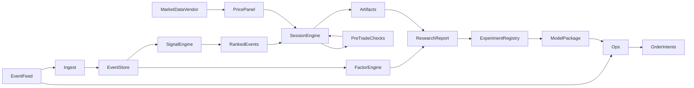

# qresearch

## 1. 定位

面向 research agent 的事件驱动股票研究内核 + 日频运维出口（Ops），在**独立 git 仓库**中实现（包名建议 `qresearch`，CLI 入口 `qr`）。

- 配置与报告使用统一领域模型（§2）。
- 事件与行情经 adapter 接入；核心 schema 与具体文件列名无关。
- 实验可复现（snapshot、数据指纹、`adjustment.as_of`），规格可晋升为 Model Package。
- **不依赖** `vnpy_portfoliostragtegy` 的 Python 包或策略代码。

| 范围 | 非范围 |
|------|--------|
| 事件 IC、组合仿真、walk-forward、Optuna、HTML/JSON 报告、order intents | 经纪商 OMS、实时行情、全市场信号生产 |
| Agent JSON CLI | 与其它回测引擎数值对齐 |

```bash
pip install -e .
```

产物目录：`runs/`、`packages/`、`.cache/`（gitignore）。

---

## 2. 领域模型

### 2.1 Event

| 字段 | 含义 |
|------|------|
| `instrument` | 标的 ID（A 股默认 `XXXXXX.SZ/.SH`；其它编码在 ingest 转换） |
| `decision_date` | 决策日（信息集截止） |
| `entry_intent_date` | 计划首次开仓交易日 |
| `exit_intent_date` | 计划平仓日 |
| `features.*` | 事件特征 |

默认 `decision_date = entry_intent_date`。延迟开仓使用 `execution.lag_sessions`，不做隐式日期偏移。

Ingest：`columns.aliases`；多值字段 `coalesce: last|max|first`。

### 2.2 Portfolio

| 键 | 默认 | 含义 |
|----|------|------|
| `portfolio.starting_cash` | `1_000_000` | 初始现金 |
| `portfolio.currency` | `CNY` | 计价货币 |
| `portfolio.sizing` | `equal_weight` | 当日新开仓等权 |
| `portfolio.sizing_base` | `cash` | 权重分母：`cash` \| `nav`（V1 实现 cash） |
| `portfolio.max_weight` | `0.35` | 单标的上限 |
| `portfolio.max_names` | `null` | 最大持股数 |
| `portfolio.max_new_entries_per_day` | `10` | 单日最大新开仓数 |
| `portfolio.lot_size` | `100` | 最小交易单位 |

Sizing（V1）：预算等分 → `max_weight` 封顶 → 整手向下取整 → 剩余按每手成本贪心加手。  
预留：`fixed_notional`、`volatility_target`。

### 2.3 Execution

| 键 | 默认 | 含义 |
|----|------|------|
| `execution.price` | `open` | `open` \| `close` |
| `execution.lag_sessions` | `0` | 决策日后延迟会话数 |
| `execution.order_validity_sessions` | `5` | GTD；`1` = good-for-day |
| `execution.entry_filter.enabled` | `false` | 开盘相对参照收益过滤 |
| `execution.entry_filter.min_open_ret` / `max_open_ret` | — | 收益区间 |
| `execution.entry_filter.ref` | `decision_prior_close` | `decision_prior_close` \| `session_prior_close` |

未成交则在有效期内下一交易日重试。成交价取成交会话的 `execution.price`。

### 2.4 Costs

| 键 | 含义 |
|----|------|
| `costs.commission_rate` | 佣金比例 |
| `costs.commission_min` | 单笔最低佣金 |
| `costs.stamp_duty_rate` | 卖出印花税 |
| `costs.slippage_bps` | 滑点（可分买卖） |

### 2.5 Risk

| 键 | 含义 |
|----|------|
| `risk.stop_loss` / `take_profit` | 相对入场价 |
| `risk.max_hold_sessions` | 最大持有交易日 |
| `risk.exit_priority` | stop → take_profit → max_hold → exit_intent → deferred_exit |

T+1：开仓当日不可平仓（`asof_session > entry_session`）。

Pre-trade checks：每个交易日基于当日 `PortfolioState`（新开仓配额、`max_names`、`max_weight`、可成交性等）。

### 2.6 Microstructure

`LimitBook`：涨跌停 / 停牌 → 可成交性。V1 为昨收×板距启发式；可替换为官方涨跌停价与停牌日历。

### 2.7 Adjustment

默认前复权；`adjustment.as_of` 为 PIT 时点（通常等于面板 `end`）。Cache key 含 `adjustment.as_of`；报告披露复权假设。

### 2.8 Calendar & benchmark

沪深交易日历；可配基准指数；绩效含绝对与相对指标（超额、IR）。

### 2.9 Data fingerprint

对加载文件聚合 `path + mtime_ns + size`；不可用时标记 `fingerprint=unavailable`，配合 `clear-cache` 与 cache key 失效。

---

## 3. 架构



| 组件 | 职责 |
|------|------|
| EventFeed / Ingest | 事件读入、映射、校验 → EventStore |
| MarketDataVendor | 日线 OHLCV（zer0share `LocalPro`） |
| FactorEngine | 事件 IC / 分位 |
| SignalEngine | 过滤与排序 → RankedEvents |
| PreTradeChecks | 日度约束 |
| SessionEngine | 有效期、sizing、成本、T+1、退出 |
| ResearchReport | HTML + JSON |
| ExperimentRegistry | 不可变 run |
| ModelPackage | 版本化冻结规格 |
| Ops | 同构链路 → order intents（`paper` / `signal`） |

---

## 4. 数据

- EventFeed：显式路径或 glob。
- 可选 `configs/examples/` ingest/signal 演示。
- PricePanel 区间由 intent、`max_hold`、`order_validity`、缓冲推导；universe = 事件标的 ∪ 基准 ∪ 持仓。
- Vendor：`ZER0SHARE_ROOT` / `ZER0SHARE_DATA`。
- CI 使用 `tests/fixtures` 合成数据；完整本地数据 e2e 单独标记。

---

## 5. Signal

```yaml
signals:
  filters:
    - { field: features.x, op: ge, value: 0.9 }
  rank_by: [{ field: features.y, ascending: true }]
```

---

## 6. Walk-forward

| 项 | 规则 |
|----|------|
| 折主键 | `entry_intent_date` |
| Embargo | 可配 |
| Purge | 持有期与 OOS 相交的 IS 事件移出优化目标 |
| OOS | 仅评估 `entry_intent_date ∈ OOS`；绩效至实际平仓 |
| 目标 | trade-weighted 或带 `min_trades` 的折间 Sharpe |
| 门禁 | `n_oos_folds >= 2` |

CLI：`pipeline optimize`、`validate rolling`。

---

## 7. 实验与 Ops

```
runs/<run_id>/{meta.json,config.snapshot.yaml,artifacts/,report/}
packages/<model_id>/<version>/{spec.yaml,provenance.json,metrics_oos.json,report/}
```

Ops：Feed → Ingest → Signal(spec) → PreTrade(state) → order intents。  
`mode=signal` 且无持仓 state 时，不可标记为可实盘晋升。  
Universe 规模校验基于事件标的 ∪ 基准。

---

## 8. Agent I/O

全局：`--format json|text`、`--quiet`、`--run-id`。

JSON 模式 stdout 仅输出结果信封：

```json
{
  "schema_version": "1.0",
  "ok": true,
  "command": "pipeline.research",
  "run_id": "...",
  "status": "succeeded",
  "elapsed_ms": 0,
  "summary": {},
  "artifacts": {},
  "next_actions": [],
  "error": null
}
```

日志与进度 → stderr。退出码：`0` 成功，`2` 配置，`3` 数据，`4` 门禁 blocked，`5` 依赖缺失。大表落盘，信封给路径。

---

## 9. 工程结构（新仓库根目录）

```
<new-repo>/
  pyproject.toml
  .gitignore
  README.md
  configs/examples/
  src/qresearch/
  tests/fixtures/
  data/events/          # 可选：拷贝的样例事件 CSV
  runs/
  packages/
  .cache/
```

依赖：`typer`, `pydantic>=2`, `polars`, `pyyaml`, `numpy`, `optuna`, `jinja2`；可选 matplotlib / alphalens / TA-Lib；行情 vendor 外部提供。

---

## 10. 实施顺序

1. 脚手架、CLI 信封、fixture  
2. Ingest、PricePanel、LimitBook、指纹  
3. Signal、Factor  
4. SessionEngine  
5. Walk-forward、Optuna  
6. ResearchReport、ModelPackage  
7. Ops  
8. P0 测试、README  

---

## 11. 验收

**P0**

| ID | 标准 |
|----|------|
| COR-GFD | `order_validity_sessions=1` 仅首个尝试会话成交 |
| COR-GTD | `validity>1` 支持跨会话成交；`decision_prior_close` 锚点稳定 |
| COR-SIZE | `max_weight` 与预算下名义、整手可复现 |
| COR-T1 | T+1 |
| COR-PRE | PreTrade 随当日 state 变化 |
| AGT-1 | `--format json --quiet` 可 `json.loads` |
| AGT-2 | 失败/blocked 仍输出信封，退出码正确 |
| E2E-1 | `pipeline research` 产出 `conclusion.html` / `.json` |

**P1**：WF purge、Ops 同构 Signal、fingerprint/cache、promote 门禁、完整 artifacts。  
**P2**：性能预算、多年 OOS 折、报告完备性。

CLI 入口示例：

```
qr data ping | validate-events | clear-cache
qr pipeline research|optimize
qr validate rolling
qr factor ic|compare
qr backtest run
qr analyze report --run ...
qr promote --run ... --model-id ... --version ...
qr ops run --package ... --mode paper|signal --asof ...
qr runs list|show|compare|archive
```
